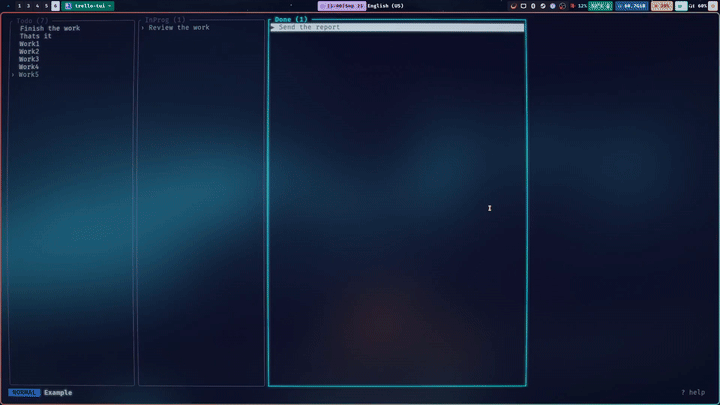

# trello-tui

A keyboard-driven Trello client for the terminal with vim-style bindings.
Built with Rust and [Ratatui](https://ratatui.rs).



## Install

**Arch Linux** — available on the AUR as [`trello-tui`](https://aur.archlinux.org/packages/trello-tui):

```sh
yay -S trello-tui   # or: paru -S trello-tui
```

**From source:**

```sh
cargo install --path .
```

## Setup

1. **API key** — create a Power-Up at <https://trello.com/power-ups/admin> and open its *API key* tab.
2. **Token** — visit (replace `YOUR_KEY`):
   `https://trello.com/1/authorize?expiration=never&scope=read,write&response_type=token&key=YOUR_KEY`
3. Create `~/.config/trello-tui/config.toml`:

   ```toml
   api_key = "..."
   token = "..."
   # default_board = "My board"  # open this board on startup
   # column_width = 32
   ```

   `TRELLO_API_KEY` / `TRELLO_TOKEN` environment variables override the file.

```sh
trello-tui --boards   # check credentials: prints your boards and exits
trello-tui
```

## Command line

Subcommands run once and exit, so scripts and AI agents can use the board without the TUI.
Output is tab-separated; add `--json` for JSON. Boards and lists can be given by id, name
(case-insensitive) or a unique part of the name; `--board` defaults to `default_board`.
Cards can be given by id, short link or URL. Errors go to stderr with a non-zero exit code.

```sh
trello-tui boards
trello-tui lists  -b Work
trello-tui cards  -b Work [-l "To Do"] [--json]
trello-tui add "Fix login bug" -b Work -l "To Do" [-d "details"] [--top]   # prints id and URL
echo "long description" | trello-tui add "Title" -l Doing -d -           # `-` reads stdin
trello-tui show   <card> [--json]
trello-tui edit   <card> [-n "new name"] [-d "new description"]
trello-tui move   <card> -l Done [--top]
trello-tui comment <card> "Done in abc123"
trello-tui archive <card>
```

Run `trello-tui help <command>` for details.

### Using it from an AI agent

[`skills/trello/SKILL.md`](skills/trello/SKILL.md) teaches an agent the commands. For Claude Code, install it as a skill:

```sh
mkdir -p ~/.claude/skills && cp -r skills/trello ~/.claude/skills/
```

Other agents can read the same file: paste it into (or link it from) your `AGENTS.md` or rules file.

## Keys

| Key | Action |
|---|---|
| `h` / `l` | previous / next list |
| `j` / `k` | next / previous card (counts work: `5j`) |
| `gg` / `G` / `5G` | first / last / 5th card |
| `Ctrl-d` / `Ctrl-u` | half page down / up |
| `Enter` | open card details / open board |
| `Esc` / `q` | close / back to board list (`q` there quits) |
| `o` / `O` | new card below / above (Enter adds another, Esc stops) |
| `A` | new list after the current one (Enter adds another, Esc stops) |
| `r` / `cw` | edit name / replace name |
| `e` | edit description |
| `dd` / `u` | archive card / undo archive |
| `D` | delete card permanently (asks y/N) |
| `X` | archive the current list and its cards (asks y/N; Trello can't delete lists) |
| `H` / `L` | move card to previous / next list |
| `J` / `K` | move card down / up (counts work) |
| `/` `n` `N` | search card names, next / previous match |
| `:b [name]` | board list, or jump to a board by name |
| `:r`, `R`, `Ctrl-r` | refresh |
| `:noh` | clear search highlight |
| `:q`, `Ctrl-c` | quit |
| `?` | help |

The description editor is modal: it opens in normal mode (`hjkl w b e 0 $ gg G x D dd p u Ctrl-r`,
`i a A I o O` to insert). Save with `:w`, `:wq`, `ZZ` or `Ctrl-s`; discard with `:q!` or `ZQ`.

Changes are shown immediately and saved in the background, in order. If a save fails, the board reloads from Trello.

## Development

`TRELLO_API_BASE` points the client at a different server (e.g. a local mock) instead of `https://api.trello.com/1`.
